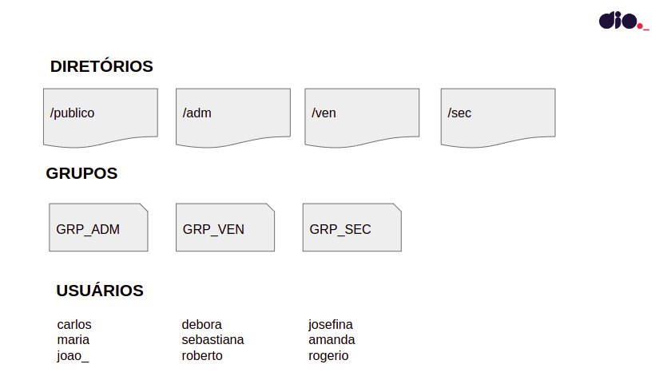

# Infraestrutura como Código: Script de Criação de Estrutura de Usuários, Diretórios e Permissões
O projeto consiste em um desafio do curso de Linux da plataforma [Digital Innovation One - DIO](https://www.dio.me/), cujo objetivo é colocar em prática os conhecimentos obtidos durante as aulas criando um script para automatizar a criação de diretórios, usuários, grupos e as permissões de cada diretório.

## ❓ Como funciona
Os usuários serão criados e atribuídos aos respectivos grupos, conforme a imagem abaixo.



O sistema funciona da seguinte forma:

* O dono de todos os diretórios criados será o usuário root;
* Todos os usuários terão permissão total dentro do diretório publico;
* Os usuários de cada grupo terão permissão total dentro de seu respectivo diretório;
* Os usuários não poderão ter permissão de leitura, escrita e execução em diretórios de departamentos que eles não pertencem.


## ⚙️ Como rodar
Primeiramente, é necessário clonar o repositório e entrar na pasta `scripts/`:
```bash
git clone https://github.com/LorrayneCardozo/infraestrutura-como-codigo.git
cd scripts
```

Em seguida, logar como root, atribuir permissão de execução ao arquivo `iac.sh` e, por fim, executá-lo:
```bash
chmod +x iac.sh
./iac.sh
```


## 💻 Como visualizar 
Para visualizar os usuários criados:
```bash
cat /etc/passwd
```
Para visualizar os grupos criados:
```bash
cat /etc/group
```


## ❌ Como excluir tudo
Para excluir os diretórios, usuários e grupos criados, é necessário atribuir permissão de execução ao arquivo `deletar.sh` e, por fim, executá-lo:
```bash
chmod +x deletar.sh
./deletar.sh
```